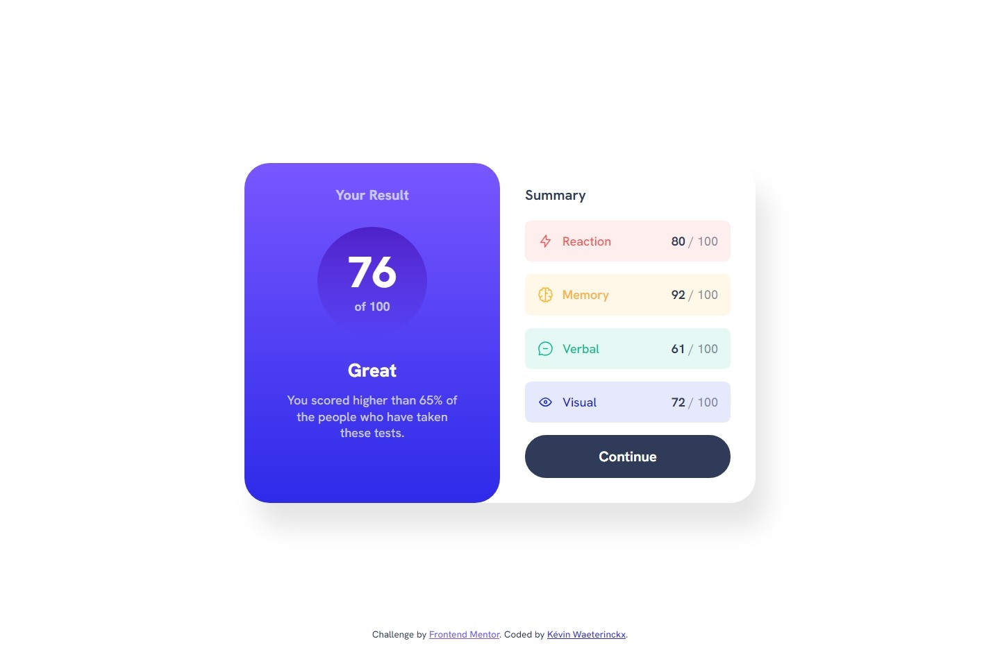

# Frontend Mentor - Results summary component solution

This is a solution to the [Results summary component challenge on Frontend Mentor](https://www.frontendmentor.io/challenges/results-summary-component-CE_K6s0maV). Frontend Mentor challenges help you improve your coding skills by building realistic projects. 

## Table of contents

- [Overview](#overview)
  - [The challenge](#the-challenge)
  - [Screenshot](#screenshot)
  - [Links](#links)
- [My process](#my-process)
  - [Built with](#built-with)
  - [What I learned](#what-i-learned)
  - [Continued development](#continued-development)
- [Author](#author)

## Overview

### The challenge

Users should be able to:

- View the optimal layout for the interface depending on their device's screen size
- See hover and focus states for all interactive elements on the page
- **Bonus**: Use the local JSON data to dynamically populate the content

### Screenshot

### Links

- Solution URL: [Code on GitHub](https://github.com/kwaeterinckx/FrontendMentorChallenge-ResultsSummaryComponent)
- Live Site URL: [Live version on Netlify](https://kaleidoscopic-bunny-3c5db9.netlify.app/)

## My process

### Built with

- Semantic HTML5 markup
- CSS custom properties
- Flexbox
- CSS Grid
- Mobile-first workflow
- JavaScript

### What I learned

Fetch data from JSON into HTML.  
I took the initiative to change some data in the json file. I replace the image path with a class name.  
The icons are managed with CSS with the pseudo element ***::before***.  

I also decided to use Git only via the console, and not using the GUI of GitHub Desktop.  
To implement the counter *(see [Continued development](#continued-development))*, I created a branch where I worked on my *feature*, and merged the results, without any interaction with the GUI. Except for the GitHub website, to create the remote folder and have the URL.

### Continued development

After I was done, I thought I could add something extra.  
That big number in the circle needed something to look better, to be more "Tadaaaaaa!". 
Why not make it a counter from 0 to the final score. And voilà, done! 🤩

## Author

Kévin Waeterinckx

- Frontend Mentor - [@kwaeterinckx](https://www.frontendmentor.io/profile/kwaeterinckx)
- GitHub - [kwaeterinckx](https://github.com/kwaeterinckx)
- LinkedIn - [Kévin Waeterinckx](https://www.linkedin.com/in/kévin-waeterinckx-58256518a)